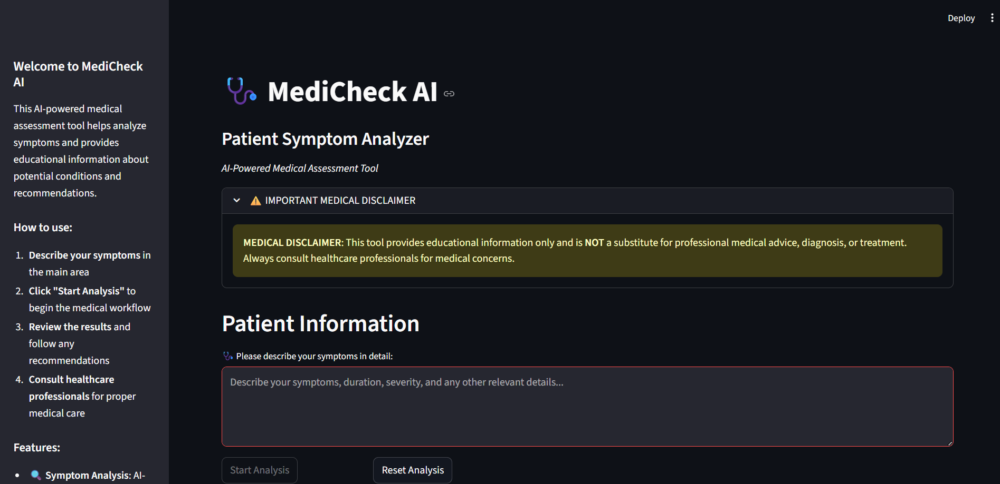
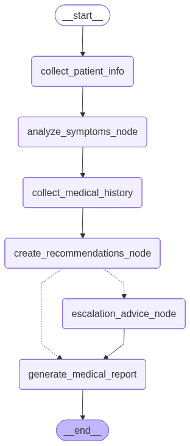

# MediCheck AI



An AI-powered, educational-only medical symptom analyzer built with Streamlit and LangGraph. It guides users through a structured workflow to summarize symptoms, suggest possible conditions, generate patient-friendly recommendations, optionally collect medical history, and produce a downloadable report.

Important: This tool is for educational purposes only and is not a substitute for professional medical advice, diagnosis, or treatment.

## Features

- Streamlit web UI with clear, guided workflow and medical disclaimer
- LangGraph-based multi-step pipeline with human-in-the-loop medical history
- Structured outputs via Pydantic models for predictable results
- Optional web research via Tavily to enhance analysis context
- Urgency detection with escalation advice for urgent cases
- One-click downloadable medical report (also saved to `medical_reports/`)

## Workflow


*MediCheck AI workflow diagram showing the step-by-step analysis process*

## Quick start

Prerequisites:
- Python 3.13+
- API keys (provider of your choice) and Tavily key if using web research

1) Clone and enter the repo
```bash
git clone <your-fork-or-repo>
cd medcheck-ai
```

2) Create a virtual environment (example with venv) and activate
```bash
python3 -m venv .venv
source .venv/bin/activate
```

3) Install dependencies
- Using pip
```bash
pip install -U pip
pip install -e .
```

Optional: using uv (if you have it installed)
```bash
uv sync
```

4) Configure environment variables in a `.env` file (recommended)
```env
# LLM provider configuration
LLM_PROVIDER=google_genai          # one of: google_genai | openai | groq
LLM_MODEL=gemini-2.5-flash         # model for your provider; examples below
LLM_TEMPERATURE=0.1

# Provider API keys (set only the one you use)
GOOGLE_API_KEY=...                 # for google_genai
OPENAI_API_KEY=...                 # for openai
GROQ_API_KEY=...                   # for groq

# Tavily (optional but recommended for web research)
TAVILY_API_KEY=...
```

Model examples:
- google_genai: `gemini-2.5-flash`, `gemini-2.0-flash-lite` (see Google Generative AI)
- openai: `gpt-4o-mini`, `gpt-4o`, `o4-mini` (check your access)
- groq: `llama-3.3-70b-versatile`, etc.

## Run the app (Streamlit UI)

```bash
streamlit run streamlit_app.py
```

Then open the provided local URL. Enter symptoms, click Start Analysis, provide optional medical history when prompted, review results, and download the final report. Reports are also written to `medical_reports/` with timestamped filenames.

Notes:
- After submitting medical history, the prompt will disappear and the workflow resumes.
- When the final report is displayed, the screen remains on the completed report even after downloading.

## Command-line mode (terminal)

You can also run the analysis in the terminal with a guided flow:
```bash
python main.py
```
Follow the prompts to enter symptoms and optional medical history. The report will be saved to `medical_reports/`.

## Project structure

- `streamlit_app.py` — Web UI
- `main.py` — CLI runner with a rich TUI
- `medical_workflow.py` — LangGraph workflow (nodes, edges, compilation)
- `medical_agents.py` — Node implementations (analysis, recommendations, escalation, reporting)
- `medical_state.py` — Pydantic state definitions for the graph
- `models.py` — Structured output models (symptom analysis, recommendations, escalation, summaries)
- `prompts.py` — Prompt templates for analysis, recommendations, escalation, summarization
- `utils.py` — LLM creation, Tavily search helpers, summarization utilities
- `tools.py` — LangChain tools bound to the LLM (search, analyze, recommend, escalate)
- `medical_reports/` — Saved markdown reports
- `pyproject.toml` — Project metadata and dependencies

## How it works (architecture)

The app composes a LangGraph state machine with these nodes:
1. `collect_patient_info` — Parses initial symptoms (and existing history if any)
2. `analyze_symptoms_node` — Calls an LLM (optionally uses tools) to produce structured `SymptomAnalysis`
3. `collect_medical_history` — Interrupts the graph to let the user provide medical history
4. `create_recommendations_node` — Converts analysis into patient-friendly recommendations
5. `escalation_advice_node` — Generates urgent guidance if the case is classified as urgent
6. `generate_medical_report` — Produces and saves a comprehensive markdown report

The LLM provider and model are selected via environment variables and instantiated in `utils.create_llm()` using LangChain’s `init_chat_model`.

## Disclaimer

This application provides educational information only and does not provide medical advice, diagnosis, or treatment. Always consult a qualified healthcare professional for medical concerns.
